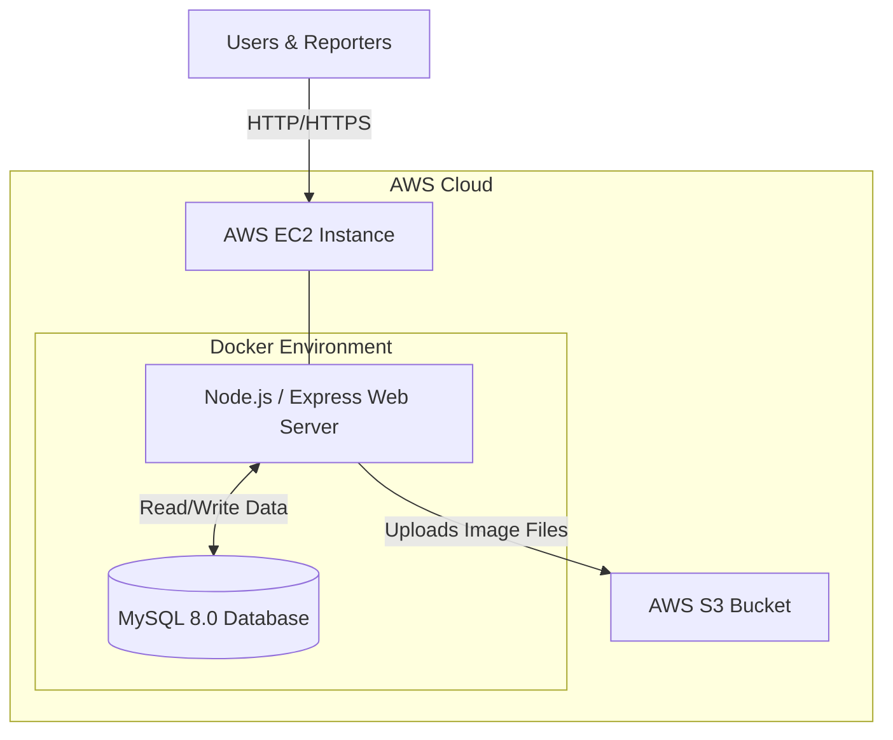

# 📰 NewsHub Digital Media Cloud


NewsHub Digital Media Cloud is a highly scalable, centralized cloud platform built for modern news publishing organizations. It moves away from isolated, disconnected systems and utilizes enterprise-grade cloud deployment practices, containerization, and managed cloud storage to deliver a seamless editorial experience.

## 🌟 Key Features
- **High-Fidelity Newspaper UI:** A responsive, black-and-white grid UI inspired by premium publications (The New York Times, The Hindu) enforcing strict aspect-ratio alignment.
- **Reporter Dashboard:** A secured backend portal allowing staff to publish, manage, and delete articles on the fly.
- **Dynamic Categorization:** Real-time filtering of news by topics (National, World, Business, Tech, Science, Sports, etc.).
- **Cloud Media Storage:** Direct integration with AWS S3 for all image uploads, ensuring the application remains stateless and highly scalable.
- **Containerized Architecture:** The Node.js application and MySQL database are entirely containerized via Docker for rapid, consistent deployment across environments.

---

## 🏗️ Cloud Architecture

The architecture was designed for high availability, fault tolerance, and cost efficiency on Amazon Web Services (AWS).

* **Compute:** AWS EC2 (Ubuntu Linux) acts as the host server.
* **Orchestration:** Docker Compose isolates the Web and Database layers.
* **Database:** MySQL 8.0 securely handles article data and metadata.
* **Storage:** AWS S3 stores all media assets independently of the compute instance.



*(Note: The live AWS EC2 and S3 instances used for the demonstration were spun down after successful deployment to adhere to budget constraints, highlighting cost-conscious cloud management).*

---

## 🚀 Local Development Setup

Because this project is fully containerized, you can run the exact cloud architecture on your local machine with zero configuration.

### Prerequisites
- Docker & Docker Compose installed.
- An AWS Account with an active S3 Bucket.

### Installation

1. **Clone the repository**
   ```bash
   git clone https://github.com/Nupurbhoir/newshub-cloud.git
   cd newshub-cloud
   ```

2. **Configure Environment Variables**
   Create a `.env` file in the root directory and add your AWS credentials:
   ```env
   AWS_ACCESS_KEY_ID=your_access_key
   AWS_SECRET_ACCESS_KEY=your_secret_key
   S3_BUCKET_NAME=your_bucket_name
   AWS_REGION=us-east-1
   ```

3. **Build and start the containers**
   ```bash
   docker-compose up --build -d
   ```

4. **Access the Application**
   - Frontend: `http://localhost:3000`
   - Reporter Dashboard: `http://localhost:3000/dashboard`

---

## 📂 Project Structure
```text
newshub-cloud/
├── app.js               # Main Node.js/Express Server
├── docker-compose.yml   # Container Orchestration
├── Dockerfile           # Web Server Image Blueprint
├── schema.sql           # MySQL Database Initialization
├── setup_server.sh      # AWS EC2 Provisioning Script
├── views/               # EJS Frontend Templates
│   ├── index.ejs        # Main Newspaper Grid
│   ├── category.ejs     # Dynamic Category View
│   └── dashboard.ejs    # Reporter Dashboard Portal
└── public/              # Static Assets
```

---

## 💡 Cloud Optimization & TCO (Total Cost of Ownership)
This project implements several cloud best-practices:
- **Right-Sizing:** Utilizing `t2.micro` instances combined with stateless Docker containers ensures maximum compute utilization.
- **S3 Offloading:** By sending images directly to S3, the EC2 EBS volume requires minimal storage (saving costs) and the server bandwidth isn't bottlenecked by media delivery.
- **Open-Source DB Container:** Running MySQL locally via Docker on the same EC2 instance avoids the baseline $15/month cost of managed RDS databases for small-scale applications.
